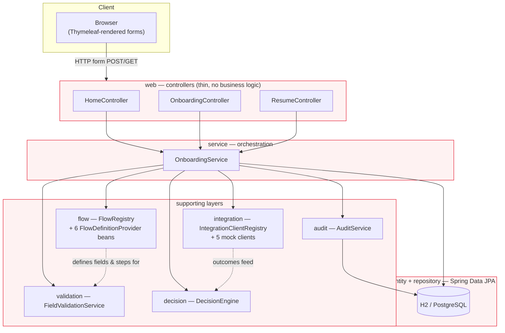

# System architecture

Layered dependency view. Arrows point from a layer to what it depends on. Nothing in `web`,
`service`, or `validation` depends on `domain.Country`/`domain.CustomerType` branching logic —
market-specific behaviour only lives in `flow.provider`.

## Why this shape

- **`OnboardingService` is the only class that knows how a step submission becomes a flow
  transition.** Everything else (validation, integration calls, decisioning, audit) is a pure
  function it calls — none of them hold flow-transition logic themselves.
- **`FlowRegistry` is built once, from Spring-discovered beans**, not a switch statement — see
  [diagram 2](02-flow-engine-class-diagram.md).
- **Controllers never touch a repository or a domain rule directly.** They translate HTTP
  in and out; `OnboardingService` is the single seam a test (or a future non-web client, e.g. an
  API) would call through.
