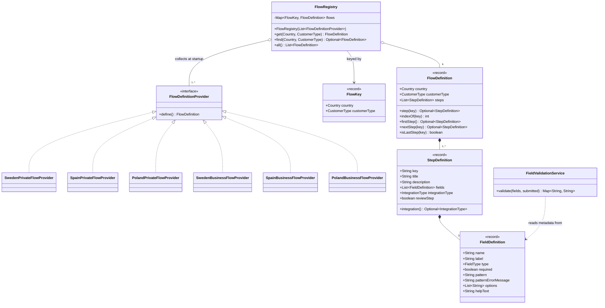

# Flow-engine class diagram

The core "no if/else tree" mechanism: six market-specific provider beans, one registry, and a
generic `FlowDefinition` / `StepDefinition` / `FieldDefinition` structure that the web layer and
validator both read at runtime instead of having market logic baked into code.

## Why this shape

- **Open/closed in practice**: adding a 7th flow (e.g. a new country, or a third customer type)
  is one new `@Component` implementing `FlowDefinitionProvider`. `FlowRegistry`, the web layer,
  and `FieldValidationService` need zero changes.
- **`FieldDefinition` is the single source of truth for a form field** — its label, type,
  required-ness, and regex pattern drive both the generic Thymeleaf template (`step.html`) and
  `FieldValidationService`. There is no second place a field's rules could drift out of sync.
- **`StepDefinition.integrationType` is optional** — a step is either pure data collection
  (e.g. contact details) or a data-collection-then-check step (e.g. identity verification). The
  orchestration service branches on *presence* of this field, not on which check it is.
