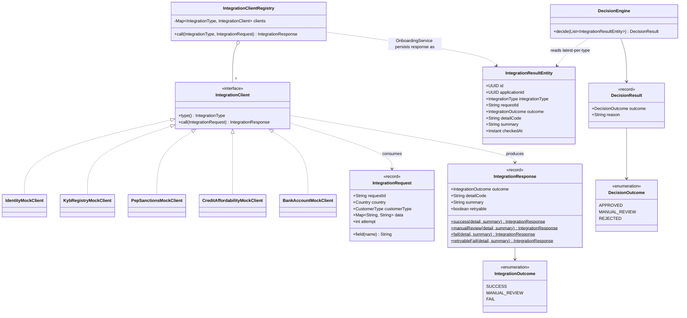
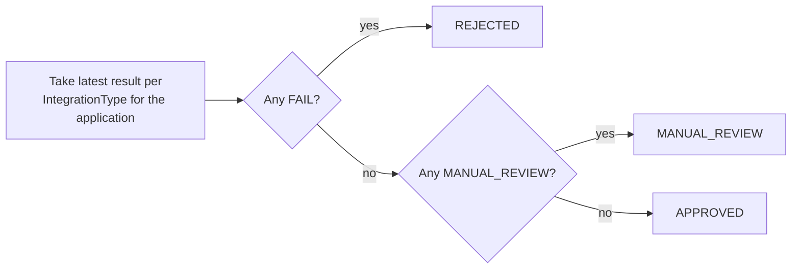

# Integration & decisioning class diagram

Five deterministic mock clients behind one interface, normalized to a tri-state outcome, so the
decision engine never has to know which specific check produced its input.

## Decisioning rule (deliberately the whole rule)

## Why this shape

- **Normalization happens at the client boundary.** `expired_id`, `dissolved`, and
  `confirmed_hit` are all just `FAIL` by the time `DecisionEngine` sees them — the specific
  `detailCode` is kept only for the audit trail and the UI message, never branched on again.
- **`DecisionEngine` has no knowledge of `Country` or `CustomerType`.** The same ~20-line rule
  handles all six flows. Precedence is FAIL > MANUAL_REVIEW > APPROVED, applied to the latest
  result per integration type (so a corrected retry supersedes an earlier failure).
- **Swapping a mock for a real client** (e.g. a real credit bureau API) means implementing
  `IntegrationClient` once — `IntegrationClientRegistry`, `OnboardingService`, and
  `DecisionEngine` are unaffected.
