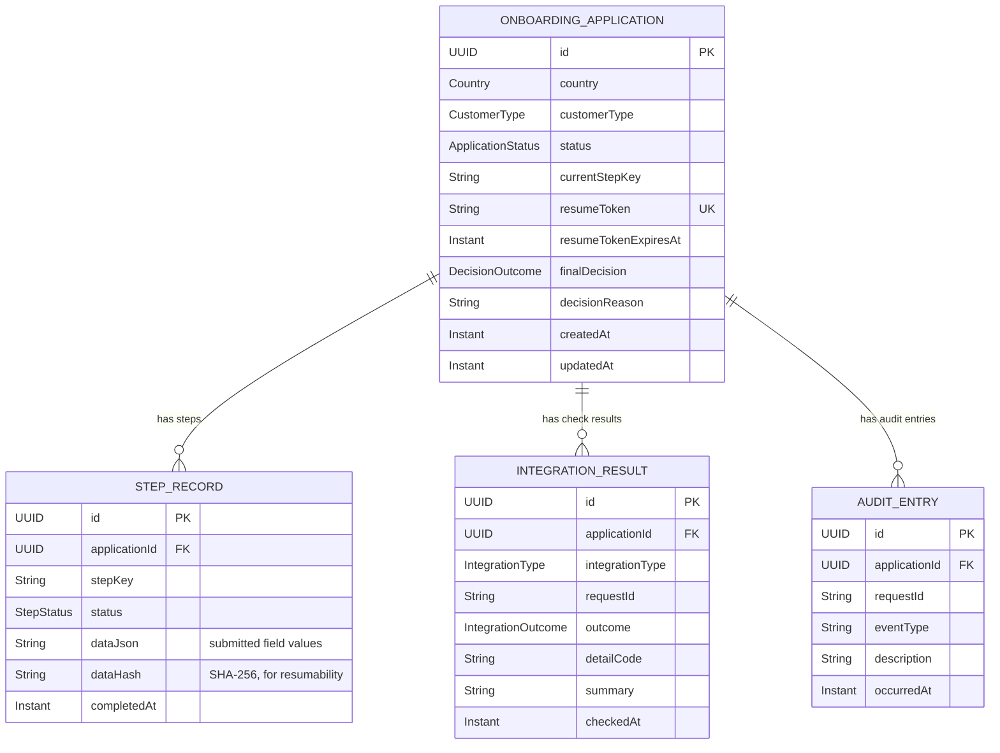

# Data model (ERD)

Everything hangs off one `onboarding_application` row by `applicationId` (no JPA `@ManyToOne`
relationships are used — the child tables hold a plain UUID foreign key and are queried
explicitly, keeping each entity simple and independently loadable).

## Why this shape

- **`resumeToken` is unique and opaque** — a separate identifier from the application's own
  `id`, per the brief's explicit "use a resume token rather than a raw application ID" guidance.
  The application `id` is fine to expose in URLs during an active session; only the *resume* link
  uses the token.
- **`StepRecordEntity.dataHash`** is what makes resumability cheap without re-running a check:
  resubmitting a step with an unchanged hash skips calling its integration client again.
- **`AuditEntryEntity` never stores `dataJson`-style payloads** — only `eventType`,
  `description` (built from outcome codes, not raw answers), and a `requestId` for tracing. It's
  safe to show to a support agent without a data-handling review.
- **`IntegrationResultEntity` keeps every attempt**, not just the latest — so a timeout-then-retry
  sequence (see [diagram 6](06-sequence-decision-resume-retry.md)) is fully reconstructable from
  the audit trail, even though `DecisionEngine` only reasons about the latest result per type.
