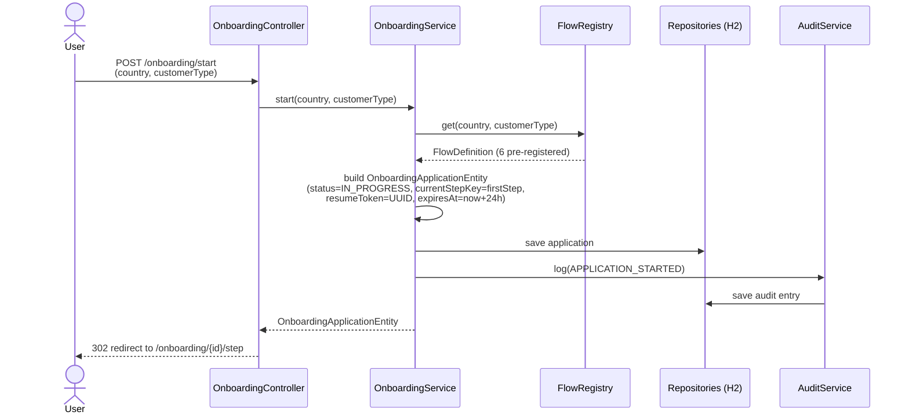
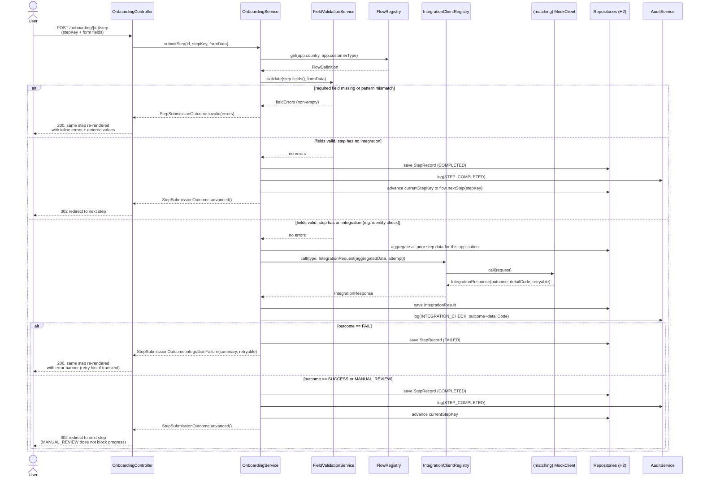

# Sequence — start an application & submit a step

## Starting an application

## Submitting a step (three outcomes)

## Why this shape

- **Validation always runs before any integration is called** — an invalid form never triggers a
  (mock, but conceptually billable/rate-limited) external check.
- **A FAIL response never advances the flow**, but the user isn't stuck: their entered values are
  preserved and re-rendered, so correcting one field (e.g. an ID number) and resubmitting is the
  entire recovery path — no separate "go back" affordance needed.
- **MANUAL_REVIEW never blocks** — it's recorded and only surfaces at the final decision, matching
  how a real onboarding product keeps the applicant moving while a human reviews in parallel.
