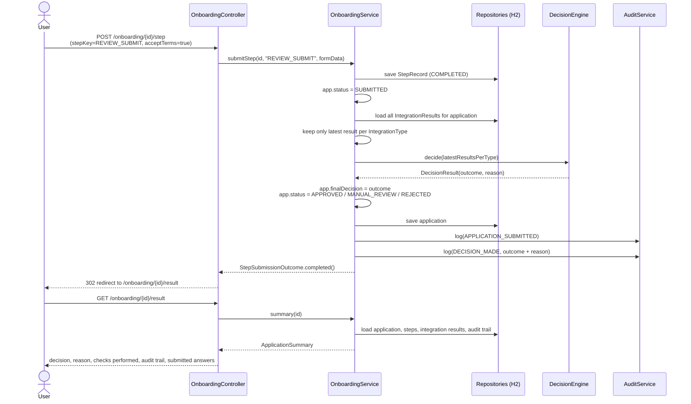
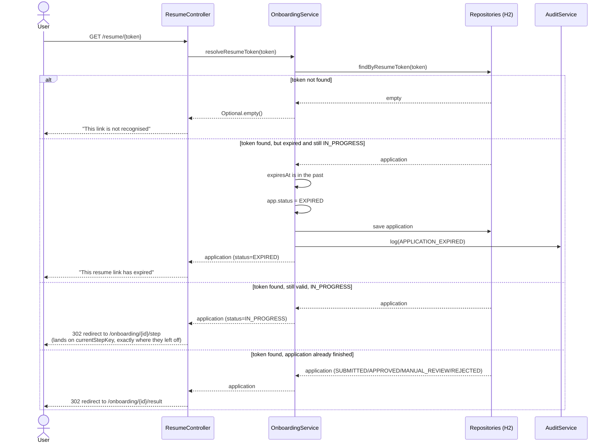
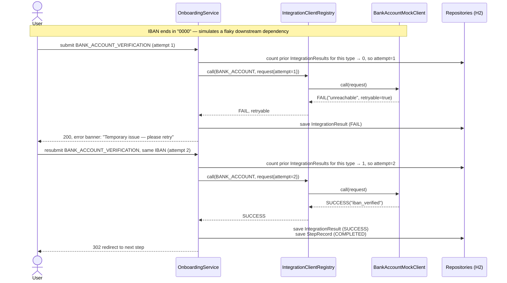

# Sequence — final decision, resuming, and a transient retry

## Submitting the review step → final decision

## Resuming a dropped-off application

## Transient failure → retry (bank account verification)

## Why this shape

- **The decision is computed once, synchronously, at review submission** — not per-step — so a
  step's individual outcome (e.g. a manual-review PEP hit) never prematurely ends the journey;
  only the aggregate at the end does.
- **Resume tokens are checked lazily.** There's no background sweep marking applications expired
  on a timer; the check happens the moment someone actually uses the link, which is the only
  moment it matters for a UX standpoint and keeps the demo self-contained (documented as a
  known simplification in the README).
- **`attempt` is derived from existing `IntegrationResult` rows**, not a separate counter field —
  simple, but as noted in the README this means concurrent retries from two tabs could race; an
  explicit counter would be the production fix.
