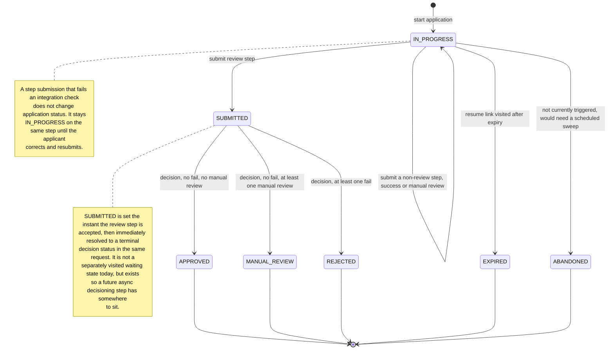

# Application state machine

`ApplicationStatus` distinguishes an in-progress session from every kind of "done" so a resumed
session, a finished one, and a dead one are never conflated.

## Why this shape

- **`EXPIRED` vs `ABANDONED`** are deliberately separate states even though only `EXPIRED` is
  currently reachable: `EXPIRED` means "the resume window ran out", `ABANDONED` would mean "no
  activity for N days regardless of token expiry" — a genuinely different signal for reporting,
  worth keeping distinct even though only one is wired up in this take-home scope.
- **A per-step integration `FAIL` is not a status transition.** It's local to the step
  (`StepRecordEntity.status = FAILED`); the application-level status only ever reflects where the
  applicant is in the overall journey, not the outcome of their last keystroke.
