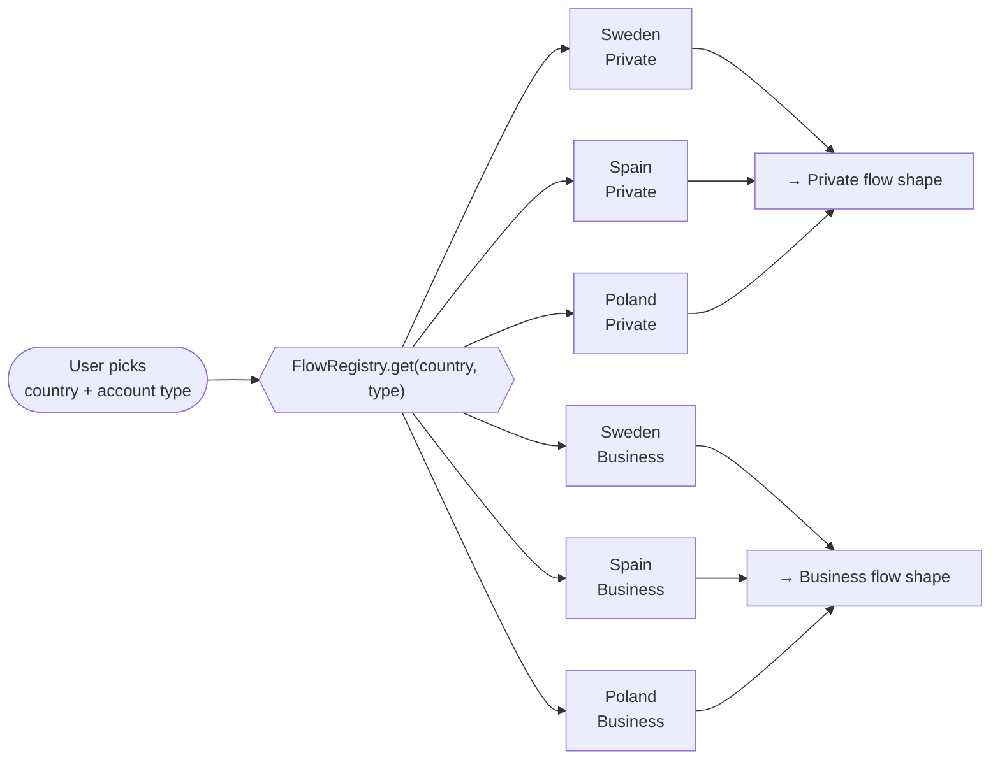
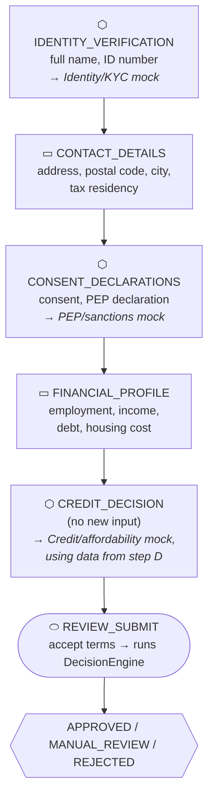
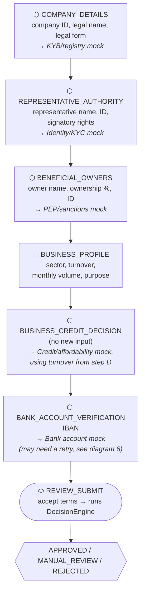

# Onboarding flow shape

How the six configured flows (3 countries × 2 customer types) are structured. Shape legend:
▭ = pure data-collection step · ⬡ = data + triggers a mock check · ⬭ = review/submit step.

## Selecting a flow

Only the field set and validation patterns differ between Sweden/Spain/Poland (e.g. personnummer
vs. DNI/NIE vs. PESEL) — the *step shape* is identical within each customer type across all three
markets, because all three providers compose the same kind of steps.

## Private individual flow (identical shape for SE / ES / PL)

## Business flow (identical shape for SE / ES / PL)

## Why this shape

- **Business has one more step than private** (`BANK_ACCOUNT_VERIFICATION`) — split out on
  purpose, not folded into the credit step, specifically to give the timeout/retry requirement a
  dedicated, visible place in the journey (see README "assumptions" for the reasoning).
- **Every check step's mock is called with the full data collected so far**, not just that step's
  own fields — e.g. `CREDIT_DECISION` has no form fields of its own; it reuses income/debt/housing
  captured on `FINANCIAL_PROFILE`. This is why `IntegrationRequest.data` is the *aggregated*
  application data, not just the current step's submission (see
  [diagram 3](03-integration-decisioning-class-diagram.md)).
- **The review step is always last and always triggers `DecisionEngine`** — it's the one place
  `StepDefinition.reviewStep == true`, and `OnboardingService` checks that flag rather than
  comparing against a hardcoded step key.
